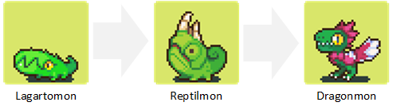

## Entrega 2 - Hibernate

¡Felicitaciones!  La prueba de concepto ha sido exitosa.  Se ha aprobado el presupuesto para desarrollar el juego Bichomon GO y es hora de empezar a implementar funcionalidad.

## Cambios desde el TP anterior
Se identificaron una serie de cambios necesarios a hacerse sobre la prueba de concepto anterior:

- Por simplicidad un `Bicho` ya no tendrá un nombre asociado, el metodo `crearBicho` del servicio `EspecieService` deberá ser modificado de acuerdo a esto.
- La capa de persistencia deberá cambiarse para utilizar Hibernate/JPA en lugar de JDBC.

## Funcionalidad

### Entrenadores y niveles
Existen entrenadores (cada jugador dentro del sistema es representado por un `Entrenador`).  Un entrenador tiene un nombre (el cual debe ser único), una cierta cantidad de puntos de experiencia y un nivel.

Distintas acciones en el juego harán que la cantidad de puntos de experiencia del entrenador se incrementen (ver sección "puntos de experiencia"). Cuando los mismos superen un cierto limite el entrenador subirá de nivel.

- *Nivel 1*: de 1 a 99 puntos de experiencia
- *Nivel 2*: de 100 a 400 puntos de experiencia
- *Nivel 3*: de 400 a 1000 puntos de experiencia
- *Niveles de 4 a 10*: suben cada 1000 puntos de experiencia

Nos destacan la importancia de que dichos limites puedan ser modificados sin necesidad de modificar código de la aplicación ya que es posible que los valores cambien a medida que se tenga información real sobre el uso que los jugadores daran al juego.

Un entrenador también poseerá una colección de `Bichos` capturados. La cantidad de bichos capturados no podrá superar un número máximo preestablecido en función de cada nivel. De haberse llegado a dicho máximo el jugador no podrá buscar nuevos `Bichos` para capturar.

Adicionalmente cada entrenador poseerá también una ubicación en la que se encuentra actualmente.

### Especies y evolución
Hasta ahora todo `Bicho` pertenecía a una `Especie` que le era fija. En esta entrega modificaremos eso: la especie de un `Bicho` podrá cambiar al *evolucionar* el mismo.

Se conoce de antemano que especies evolucionan en que especies. Para que un bicho de una cierta especie evolucione deberá cumpliarse una determinada `Condicion`. A priori existen los siguientes tipos de condiciones para evolucionar:

- *basadas en energía*: un bicho podrá evolucionar solo cuando su energía supere cierto número.
- *basadas en victoria*: un bicho podrá evolucionar cuando la cantidad de victorias del mismo supere cierto número.
- *basadas en edad*: un bicho podrá evolucionar solo cuando haya transcurrido determinado tiempo desde su fecha de captura.
- *basadas en nivel*: un bicho solo podrá evolucionar cuando su entrenador posea un nivel superior a un número determinado.

Es necesario poder combinar las condiciones de forma que pueda configurarse más de un requisito para evolucionar.

_Ejemplo_:
<p align="center">
  
</p>
* _*Lagartomon* podrá evolucionar en *Reptilmon* si su poder supera los 100 puntos._
* _*Reptilmon* podrá evolucionar en *Dragonmon* si su poder supera los 1000 puntos, su entrenador es de nivel 5 o superior y si ganó mas de un combate._

### Ubicaciones
Las ubicaciones pueden ser `Pueblos`, `Guarderías` o `Dojos`. Toda ubicación tendrá un nombre que deberá ser único.  Un entrenador podrá buscar nuevos bichos en la ubicación en la que se encuentre, cualquiera fuese su tipo.

#### Guarderías
Debido a que los entrenadores poseen un máximo de bichos en su inventario de capturados los mismos podrán *abandonar* aquellos que no deseen utilizar nuevamente en esta ubicación. Un entrenador no podrá quedarse sin bichos como consecuencia de abandonar.

Al *buscar* en esta ubicación un entrenador adoptará bichos que hayan sido abandonados anteriormente por algún entrenador distinto a el mismo.

#### Dojos
Los dojos son ubicaciones especiales de combate. Los dojos pueden poseer un campeon (un `Bicho` específico de un `Entrenador` específico). Un entrenador (que no sea el campeon actual del Dojo) podrá retar a *duelo* al campeon en esta localización.

Al *buscar* en este tipo de ubicación un entrador encontrará bichos de la misma especie que la especie "raiz" del actual campeon del Dojo. Por especie "raiz" nos referimos a aquella que sea la primera en su rama de evolución.

_Ejemplo: El dojo CobraKai tiene un Dragonmon como campeon. Si el entrenador MiyaguiSan buscase bichos en este dojo lo unico que encontraría (si es que encontrase algo) serían bichos de tipo Lagartomon_.

#### Pueblos
Son el tipo mas común de ubicación.  En las mismas los entrenadores no podrán realizar ninguna otra acción que no sea *buscar* nuevos bichos.

Al *buscar* en los `Pueblos` un entrenador podrá encontrar bichos salvajes de manera aleatoria.  Cada pueblo contendrá una lista de especies de bichos que lo habitan, con una probabilidad de ocurrencia propia para cada una de las especies.

_Ejemplo:  En un pueblo llamado Starland pueden encontrarse bichos de especie Estrellamon, Nubemon y Dragonmon. Las probabilidades para cada uno son 90, 9 y 1, lo que quiere decir que 90 de cada 100 veces que un jugador encuentre un bicho salvaje el mismo será de tipo Estrellamon._

### Busquedas
Como ya dijimos un entrenador podrá buscar bichos el cualquier ubicación. Una busqueda deberá resolverse en dos pasos

1. Se determinará si la busqueda fue exitosa.
2. Si la busqueda es exitosa se determinará cuál es el bicho encontrado (en función a lo descripto anteriormente)

La probabilidad que una busqueda de bichos en un cualquier localización resulte exitosa se resolverá de la siguiente forma.

- se incrementará conforme a la cantidad de tiempo que haya pasado desde la ultima vez que el entrenador encontró un bicho salvaje.
- decrecerá conforme al nivel del entrenador actual aumente.
- en los Pueblos decrecerá conforme a la cantidad de entrenadores en esa ubicación aumente.

Esto se traduce a:

````
busquedaExitosa = factorTiempo * factorNivel * factorPoblacion * random(0, 1) > 0.5
````

No es necesario codificar la lógica exacta para obtener dichos factores (factorTiempo, factorNivel y factorPoblacion). Por ahora solo deberemos delegar en una interfaz que encapsulará dicho calculo sin proveer una implementación real para la misma.

Si la busqueda es exitosa deberá determinarse cuál es el bicho capturado conforme a lo descripto anteriormente. El nuevo bicho será agregado al inventario de bichos capturados del entrenador.

### Duelos
En los Dojos un entrenador podrá retar a duelo al actual campeon del Dojo utilizando algun bicho de su inventario.  Si el retador triunfase este pasará a ser el nuevo campeon del dojo.

El combate consistirá en una serie de ataques.
- El primer ataque lo dará el monstruo retador. Se calculará el daño hecho por el ataque de la siguiente forma: `danioRival = energiaRetador * random(0.5 y 1)`
- El segundo ataque lo dara el rival, calculando el danio hecho al retador de igual forma: `danioRetador = energiaRival * random(0.5 y 1)`
- Retador y atacante alternaran ataques hasta que el combate esté terminado.
- Si en cualquier momento el daño acumulado entre todos los ataques recibidos supera la energía de un bicho entonces ese bicho perderá el combate.
- Si luego de 10 ataques el retador no logra vencer a su rival, entonces perderá el combate.

Luego del combate:
- El ganador será nombrado campeon del Dojo.
- Ambos bichos incrementarán su energía en un número aleatorio entre 1 y 5.

Será necesario guardar de alguna forma el historial de campeones para cada Dojo con las fechas en las que fue coronado campeon y luego depuesto.

_Ejemplo: El Starmon de DanielSan retó al Dragonmon del Dojo CobraKai a duelo. La energia de Starmon es 100, mientras que la del Dragonmon es 130. El resultado paso a paso del combate fue el siguiente:_
- _Starmon ataca a Dragonmon. Obtiene un 0.8 en valor aleatorio. Su ataque hace 80 puntos._
- _Dragonmon ataca a Starmon. Obtiene 0.5 en su valor aleatorio. Su ataque hace 75 puntos._
- _Starmon ataca nuevamente a Dragonmon. Obtiene 1 en su valor aleatorio. Su ataque hace 100 puntos de daño, que combinados a los 80 ya realizados suman un total de 180. Como 180 es mayor que la energia de Dragonmon entonces Starmon es coronado nuevo campeon_

### Experiencia
Un entrenador obtendrá puntos de experiencia por las siguientes acciones:

- *COMBATIR*: 10 puntos de experiencia
- *CAPTURAR*: 10 puntos de experiencia
- *EVOLUCIONAR UN BICHO*: 5 puntos de experiencia

_BONUS:_ Se pide que estos valores esten configurados en alguna tabla parametrica en la base de datos y no harcodeados en código.

## Servicios
Se pide que implementen los siguientes servicios los cuales seran consumidos por el frontend de la aplicación.

#### BichoService
- `buscar(String entrenador):Bicho` el entrenador deberá buscar un nuevo bicho en la localización actual en la que se encuentre. Si la captura es exitosa el bicho será agregado al inventario del entrenador (ver sección _Busquedas_) y devuelto por el servicio.

- `abandonar(String entrenador, int bicho):void` el entrenador abandonará el bicho especificado en la localización actual. Si la ubicación no es una `Guarderia` se arrojará `UbicacionIncorrectaException`.

- `duelo(String entrenador, int bicho):ResultadoCombate` el entrenador desafiará al actual campeon del dojo a duelo. Si la ubicación no es un `Dojo` se arrojará `UbicacionIncorrectaException`. El objeto resultante `ResultadoCombate` informará no solo quién fue el ganador del combate sino el resultado de cada uno de los ataques realizados.

- `puedeEvolucionar(String entrenador, int bicho):boolean` deberá devolver true si el bicho especificado está en condiciones de evolucionar.

- `evolucionar(String entrenador, int bicho):Bicho` evoluciona el bicho especificado (si cumple con las codiciones para evolucionar)

#### MapaService
- `mover(String entrenador, String ubicacion):void` se cambiará al entrenador desde su ubicación actual a la especificada por parametro.

- `cantidadEntrenadores(String ubicacion):int` se deberá devolver la cantidad de entrenadores que se encuentren actualmente en dicha localización.

- BONUS: `campeon(String dojo):Bicho` retorna el actual campeon del Dojo especificado.

- BONUS: `campeonHistorico(String dojo):Bicho` retorna el bicho que haya sido campeon por mas tiempo en el Dojo.

#### LeaderboardService
- `campeones():List<Entrenador>` retorna aquellos entrenadores que posean un bicho que actualmente sea campeon de un Dojo, retornando primero aquellos que ocupen el puesto de campeon desde hace mas tiempo.

- `especieLider():Especie` retorna la especie que tenga mas bichos que haya sido campeones de cualquier dojo. Cada bicho deberá ser contando una sola vez (independientemente de si haya sido coronado campeon mas de una vez o en mas de un Dojo)

- BONUS: `lideres():List<Entrenador>` retorna los diez primeros entrenadores para los cuales el valor de poder combinado de todos sus bichos sea superior.

#### EspecieService
- `populares():List<Especie>` retorna aquellos diez especies mas populares, o sea, aquellas que tengan mas bichos en manos de distintos entrenadores.  No contaran los bichos en la Guardería.

- BONUS: `impopulares():List<Especie>` retorna aquellos diez especies menos populares, o sea, aquellas que tengan actualmente mas bichos en la Guardería.

## Se pide:
- Que provean implementaciones para las interfaces descriptas anteriormente.
- Que modifiquen el mecanismo de persistencia de `Especie` de forma de que todo el modelo persistente utilice Hibernate.
- Asignen propiamente las responsabilidades a todos los objetos intervinientes, discriminando entre servicios, DAOs y objetos de negocio.
- Creen test unitarios para cada unidad de código entregada que prueben todas las funcionalidades pedidas, con casos favorables y desfavorables.
- Que los tests unitarios sean deterministicos. Hay mucha lógica que depende del resultado de un valor aleatorio. Se aconseja no utilizar directamente generadores de valores aleatorios (random) sino introducir una interfaz en el medio para la cual puedan proveer una implementacion mock determinsitica en los tests.

### Consejos utiles:
- Enfoquense primero en el modelo y la capa de servicios, traten de asignar responsabilidades a sus objetos para resolver los casos de uso propuestos.
- Pueden comenzar trabajando con implementaciones mock de su capa de DAOs. No es necesario que utilicen algun framework de mocking, pueden simplemente codifcar DAOs que persistan los objetos en mapas y los recuperen desde ahi.
- Una vez que tengan el modelo terminado y validado persistanlo utilizando hibernate, en este punto deberan analizar:

   - Qué objetos deben ser persitentes y cuales no?
   - Cuáles son las claves primarias de cada entidad? Existe algún atributo de negocio que oficie de clave primaria o deberán introducir algun id?
   - Cuál es la cardinalidad de cada una de las relaciones? Como mapearlas?
