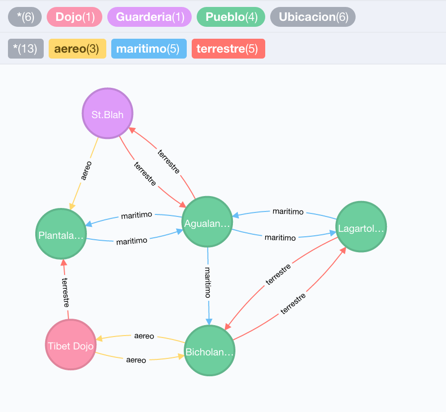

## Entrega 4 - Grafos

En nuestro sistema existen ubicaciones (Dojos, Guarderías y Pueblos). Todo entrenador
tiene actualmente una ubicación y es posible cambiar dicha ubicación por medio
del servicio que implementaron (`MapaService`)

En este TP continuaremos trabajando sobre las ubicaciones. La idea fundamental
detrás del juego es la de restringir los movimientos que los jugadores hacen. Es
decir, un entrenador no podrá arbitrariamente cambiarse de localización. Para ello
necesitaremos comenzar a modelar un "mapa" real de ubicaciones.

Cada ubicación en el mapa puede conectarse con cualquier otra ubicación por
medio de un camino. Los caminos se categorizan en tres tipos:

- caminos terrestres
- caminos maritimos
- caminos aereos

Cada entrenador tendrá una nueva propiedad, una cantidad de monedas en su billetera.
Moverse de una ubicación a otra por medio de un *camino terrestre* costará una moneda,
dos si se trata un *camino maritimo* o cinco si es un *camino aereo*.

  

## Se deberá implementar:
1. El mensaje `mover` del servicio `MapaService` deberá ser reeimplementado de forma
de que:
    * Arroje una excepcion `UbicacionMuyLejana` si no es posible llegar desde
la actual ubicación del entrenador a la nueva por medio de **un** camino.
    * Luego de moverse decremente la cantidad de monedas del entrenador en el número
adecuado.
    * Arroje una excepcion `CaminoMuyCostoso` si el entrenador no tiene suficientes
monedas para pagar el costo del camino que une a la actual ubicación con la
ubicación nueva. En caso de existir más de un camino que conecte ambas ubicaciones
entonces se deberá optar por el más barato.

2. Se deberá crear un mensaje `moverMasCorto(String entrenador, String ubicacion)`
que funcione de forma similar al anterior pero no se limite a un camino, sino que
tome la **ruta mas corta** entre ambas ubicaciones (no implica que sea la más barata)

3. Se deberá crear un mensaje `conectados(String ubicacion, String tipoCamino)` que
devuelva todas las `Ubicaciones` conectadas directamente a una ubicación provista
por medio de un tipo de camino especificado.

4. Se deberá crear un mensaje `crearUbicacion(Ubicacion ubicacion)` que cree
una nueva ubicación (la cual es provista por parametro) tanto en hibernate
como en neo4j.

5. Se deberá crear un mensaje `conectar(String ubicacion1, String ubicacion2, String tipoCamino)`
que conecte dos ubicaciones (se asumen preexistentes) por medio de un tipo de
camino.

## Se pide:
- El objetivo de esta entrega es implementar los requerimientos utilizando una
base de datos orientada a grafos.
- Creen test unitarios para cada unidad de código entregada que prueben todas las
funcionalidades pedidas, con casos favorables y desfavorables.

### Consejos utiles:
- Traten de no tocar los objetos de modelo previamente definidos (van a necesitar
  modificar `Entrenador` para agregar monedas, pero probablmeente no necesitan
  modificar nada de `Ubicacion`)
- Los caminos no son bidireccionales. Todo camino tiene una
  dirección. Los caminos bidireccionales serán sencillamente modelados como dos
  caminos en direcciones opuestas.
- Encapsulen el acceso a la base de datos detras de un DAO.
